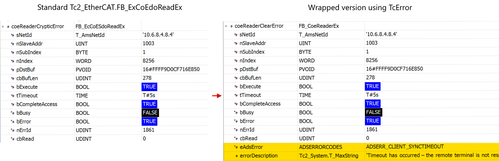

# TcError

Functions and datatypes which describe TwinCAT errors.

## Installation

[Download](https://github.com/Roald87/TcError/releases) from the releases page, or install via [📦 Twinpack](https://github.com/Zeugwerk/Twinpack).

## Example

Can be used to wrap existing TwinCAT Function Blocks to add clear error codes and messages.



### Code

```
FUNCTION_BLOCK FB_CoeReaderEx EXTENDS FB_EcCoESdoReadEx
VAR_OUTPUT
    eAdsError : TcError.AdsErrorCodes;
END_VAR
VAR
    errorDescription : Tc2_System.T_MaxString;
END_VAR

SUPER^();
eAdsError := TcError.ToAdsErrorCode(SUPER^.nErrId);
errorDescription := TcError.AdsErrorCodeDescription(eAdsError);
```

## Manual

### ADS errors

- `TYPE AdsErrorCodes` : Enum containing all ADS error codes.
- `FUNCTION ToAdsErrorCode`: Convert an ADS error code of type `UDINT` to the `AdsErrorCodes` datatype.
- `FUNCTION AdsErrorCodeDescription`: Returns an description of the error from the `AdsErrorCodes` datatype.

#### Example

```
PROGRAM MAIN
VAR
	adsErrorId : UDINT := 1802;
	adsErrorCode : AdsErrorCodes;
	errorDescription : T_MaxString;
END_VAR

adsErrorCode := TcError.ToAdsErrorCode(adsErrorId); // ADSERR_DEVICE_NOMEMORY;
errorDescription := TcError.AdsErrorCodeDescription(adsErrorCode); // 'Insufficient memory.'
```

### Win32 errors

- `TYPE Win32ErrorCodes` : Enum containing all Win32 error codes.
- `FUNCTION ToWin32ErrorCode`: Convert an Win32 error code of type `UDINT` to the `Win32ErrorCodes` datatype.
- `FUNCTION Win32ErrorCodeDescription`: Returns an description of the error from the `Win32ErrorCodes` datatype.

#### Example

```
PROGRAM MAIN
VAR
	win32ErrorId : UDINT := 82;
	win32ErrorCode : Win32ErrorCodes;
	errorDescription : T_MaxString;
END_VAR

win32ErrorCode := TcError.ToWin32ErrorCode(win32ErrorId); // ERROR_CANNOT_MAKE;
errorDescription := TcError.Win32ErrorCodeDescription(win32ErrorCode); // 'The directory or file cannot be created.'
